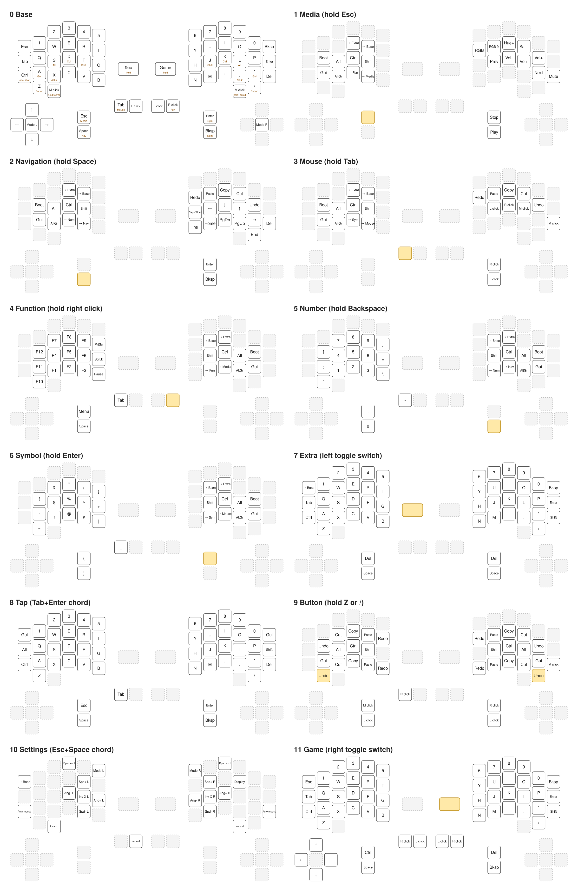

# KillerWhale DUO: Miryoku keymap

[Miryoku](https://github.com/manna-harbour/miryoku) on the KillerWhale DUO, kept in step with the
`keyball39/keymaps/miryoku` keymap in this repo. The 3x5 alpha block of every layer is identical to
the keyball39; the KillerWhale's extra keys carry board-specific extras.



`layers.svg` / `layers.png` are generated from `keymap.c` and the board geometry in `keyboard.json`:

```sh
python3 keyboards/killerwhale/duo/keymaps/miryoku/render_layers.py
```

## Physical keys

Each half has a 6-key number row, three rows of outer key plus five alphas, a 5-key bottom row
under A S D F G, a scroll button under X (left) and period (right), two stacked side keys, two keys
by the wheel (ADD1/ADD2) and a latching toggle switch. There is no joystick or dpad module fitted,
so those positions are dead.

| Physical key | Left half | Right half |
|---|---|---|
| Upper side key | Esc, hold **Media** | Enter, hold **Symbol** |
| Lower side key | Space, hold **Navigation** | Backspace, hold **Number** |
| Inner ADD key | Tab, hold **Mouse** | Left click |
| Outer ADD key | Left click | Right click, hold **Function** |
| Scroll button (under X / .) | Tap middle click, hold scroll mode | same |
| Outer column, top | Esc | Backspace |
| Outer column, middle | Tab | Enter |
| Outer column, bottom | One-shot Ctrl | Delete |
| Toggle switch | **Extra** while on | **Game** while on |

Scroll wheels scroll everywhere, page up/down on Navigation, volume on Media.

## Layers

Hold layers are numbered in the order you meet the thumbs, so the layer digit on the display reads
1 to 6.

| # | Layer | Reach it | Contents |
|---|---|---|---|
| 0 | Base | | QWERTY, home row mods (Gui Alt Ctrl Shift on A S D F, mirrored on J K L '), AltGr on X and period, Button layer on Z and slash |
| 1 | Media | hold Esc | Media keys and RGB on the right, mods on the left home row |
| 2 | Navigation | hold Space | Arrows on J K L ', Home/PgDn/PgUp/End below, Caps Word on H, clipboard on the top row, plain Enter/Backspace/Delete on the right thumbs so they auto-repeat |
| 3 | Mouse | hold Tab | Trackball switches to scroll while held, left/right/middle click on J K L and on the right thumbs |
| 4 | Function | hold right click | F1 to F12, PrtSc/ScrLk/Pause, Menu Space Tab on the left thumbs |
| 5 | Number | hold Backspace | Numpad on the left, brackets and operators around it, . 0 - on the left thumbs |
| 6 | Symbol | hold Enter | Shifted numpad, ( ) _ on the left thumbs |
| 7 | Extra | left toggle switch | Plain QWERTY, no home row mods, Space on both middle thumbs |
| 8 | Tap | Tab+Enter chord | Plain QWERTY and plain thumbs, mods on the outer columns; both top outer keys together return to Base |
| 9 | Button | hold Z or / | Undo Cut Copy Paste Redo on the top and bottom rows, mods on the home row, mouse buttons on the thumbs |
| 10 | Settings | Esc+Space chord | Trackball and display settings, see below. Esc returns to Base |
| 11 | Game | right toggle switch | See below |

The hold layers also carry Miryoku's layer locks: with a layer held, E and R (or U and I on the
right-hand layers) switch to Extra or Base, and the bottom row keys under them lock the current
layer or its partner. Q (or P) on the hold layers is the bootloader.

Home row mods use `PERMISSIVE_HOLD` and `QUICK_TAP_TERM 0`. Quick tap is turned back on for the six
thumb layer-taps only (`users/miryoku/miryoku.c`), so tap-then-hold on Space or Backspace
auto-repeats instead of switching layer.

## Settings layer (10)

Enter with the Esc+Space chord, leave with Esc. Values persist in EEPROM.

| Key | Action |
|---|---|
| 5 / 6 | Cycle left / right trackball mode: cursor, scroll, key input |
| R / V | Left trackball CPI up / down (400 to 1600 in steps of 200) |
| U / M | Right trackball CPI up / down |
| D / G | Rotate left trackball axes by 12 degrees, anticlockwise / clockwise |
| H / K | Rotate right trackball axes |
| F / J | Invert left / right trackball X axis |
| Scroll buttons, left outer ADD | Invert scroll direction |
| Outer bottom keys (Ctrl / Del position) | Toggle auto mouse layer (off by default) |
| 3 / 8 | Toggle dpad diagonal exclusion (no effect without a dpad) |
| O | Cycle the USB half's display view |

Key input mode makes trackball motion tap the four dpad keys of that half; only the left dpad has
arrows mapped, so it does nothing on the right.

## Displays

The panels are 128x32 mounted portrait; the right half's is mounted upside down and is rotated in
the driver so both read the same way regardless of which half has the USB cable.

The half **without** USB shows the layer: the vendor's big digit for layers 0 to 9, a stacked "KW"
for Settings, and a bongo cat on Game that reacts to key presses on either half.

The half **with** USB cycles through four views with O on the Settings layer:

1. **Stats** (vendor screen): `SPD` CPI per trackball, `ANG` axis rotation in degrees, `AXIS` X
   inversion, `MODE` cursor/scroll/key per trackball. The bottom line doubles as a message area
   for held modifiers, settings changes and scroll mode.
2. **WPM**: layer name and current WPM on the first line, a bar graph of the last 16 seconds
   below it.
3. **Mirror**: whatever the other half shows.
4. **Name**: the layer name in double-size text.

## Game layer (11)

Held on by the right toggle switch, so the switch position is the mode. Plain QWERTY with no home
row mods, number row for weapons, Ctrl and Space on the left thumbs, mouse buttons on the ADD keys,
arrows on the left dpad if fitted. Right hand is free for a separate mouse. The non-USB display
shows the bongo cat while the layer is on.

## Shared userspace

`users/miryoku/` is picked up by every keymap named `miryoku` (this one and keyball39):

- `autocorrect_dictionary.txt` and the generated `autocorrect_data.h`. After editing the dictionary:
  `qmk generate-autocorrect-data users/miryoku/autocorrect_dictionary.txt -o users/miryoku/autocorrect_data.h`
- `bongo_frames.h`: the cat.
- `miryoku.c`: per-key quick tap.

## Build and flash

```sh
qmk compile -kb killerwhale/duo -km miryoku
qmk flash -kb killerwhale/duo -km miryoku   # once per half, put the half into bootloader when it waits
```
